# Java 8 新特性
Java8 新增了非常多的特性，我们主要讨论以下几个：
- **Lambda** 表达式 − Lambda允许把函数作为一个方法的参数（函数作为参数传递进方法中。
- **方法引用** − 方法引用提供了非常有用的语法，可以直接引用已有Java类或对象（实例）的方法或构造器。与lambda联合使用，方法引用可以使语言的构造更紧凑简洁，减少冗余代码。
- **默认方法** − 默认方法就是一个在接口里面有了一个实现的方法。
- **新工具** − 新的编译工具，如：Nashorn引擎 jjs、 类依赖分析器jdeps。
- **Stream API** −新添加的Stream API（java.util.stream） 把真正的函数式编程风格引入到Java中。
- **Date Time API** − 加强对日期与时间的处理。
- **Optional** 类 − Optional 类已经成为 Java 8 类库的一部分，用来解决空指针异常。
- **Nashorn, JavaScript 引擎** − Java 8提供了一个新的Nashorn javascript引擎，它允许我们在JVM上运行特定的javascript应用。
  

## lambda
> Lambda 表达式，也可称为闭包，Lambda 允许把函数作为一个方法的参数（函数作为参数传递进方法中）。

语法：
````
(parameters) -> expression
或
(parameters) ->{ statements; }
````
以下是lambda表达式的重要特征:
> 可选类型声明：不需要声明参数类型，编译器可以统一识别参数值。

> 可选的参数圆括号：一个参数无需定义圆括号，但多个参数需要定义圆括号。

> 可选的大括号：如果主体包含了一个语句，就不需要使用大括号。

> 可选的返回关键字：如果主体只有一个表达式返回值则编译器会自动返回值，大括号需要指定明表达式返回了一个数值。

>>**lambda** 表达式只能引用标记了 **final** 的外层局部变量，这就是说不能在 lambda 内部修改定义在域外的局部变量，否则会编译错误。

实例：
````
// 1. 不需要参数,返回值为 5  
() -> 5  
  
// 2. 接收一个参数(数字类型),返回其2倍的值  
x -> 2 * x  
  
// 3. 接受2个参数(数字),并返回他们的差值  
(x, y) -> x – y  
  
// 4. 接收2个int型整数,返回他们的和  
(int x, int y) -> x + y  
  
// 5. 接受一个 string 对象,并在控制台打印,不返回任何值(看起来像是返回void)  
(String s) -> System.out.print(s)
````
````
public class Java8Tester {
   public static void main(String args[]){
      Java8Tester tester = new Java8Tester();
        
      // 类型声明
      MathOperation addition = (int a, int b) -> a + b;
        
      // 不用类型声明
      MathOperation subtraction = (a, b) -> a - b;
        
      // 大括号中的返回语句
      MathOperation multiplication = (int a, int b) -> { return a * b; };
        
      // 没有大括号及返回语句
      MathOperation division = (int a, int b) -> a / b;
        
      System.out.println("10 + 5 = " + tester.operate(10, 5, addition));
      System.out.println("10 - 5 = " + tester.operate(10, 5, subtraction));
      System.out.println("10 x 5 = " + tester.operate(10, 5, multiplication));
      System.out.println("10 / 5 = " + tester.operate(10, 5, division));
        
      // 不用括号
      GreetingService greetService1 = message ->
      System.out.println("Hello " + message);
        
      // 用括号
      GreetingService greetService2 = (message) ->
      System.out.println("Hello " + message);
        
      greetService1.sayMessage("Runoob");
      greetService2.sayMessage("Google");
   }
    
   interface MathOperation {
      int operation(int a, int b);
   }
    
   interface GreetingService {
      void sayMessage(String message);
   }
    
   private int operate(int a, int b, MathOperation mathOperation){
      return mathOperation.operation(a, b);
   }
}
````
>> lambda 表达式的局部变量可以不用声明为 final，但是必须不可被后面的代码修改（即隐性的具有 final 的语义）:
````
public class Java8Tester {
    public static void main(String args[]) {
        final int num = 1;
        Converter<Integer, String> s = (param) -> System.out.println(String.valueOf(param + num));
        s.convert(2);  // 输出结果为 3
    }
 
    public interface Converter<T1, T2> {
        void convert(int i);
    }
}

---------------------------------
int num = 1;  
Converter<Integer, String> s = (param) -> System.out.println(String.valueOf(param + num));
s.convert(2);
num = 5;  
//报错信息：Local variable num defined in an enclosing scope must be final or effectively 
````
>> 在 Lambda 表达式当中不允许声明一个与局部变量同名的参数或者局部变量。
````
String first = "";  
Comparator<String> comparator = (first, second) -> Integer.compare(first.length(), second.length());  //编译会出错 
````

## 默认方法
> 简单说，默认方法就是接口可以有实现方法，而且不需要实现类去实现其方法。
我们只需在方法名前面加个 default 关键字即可实现默认方法。
````
public interface Vehicle {
   default void print(){
      System.out.println("我是一辆车!");
   }
}
````
**多个默认方法:**
> 一个接口有默认方法，考虑这样的情况，一个类实现了多个接口，且这些接口有相同的默认方法，以下实例说明了这种情况的解决方法：
````
public interface Vehicle {
   default void print(){
      System.out.println("我是一辆车!");
   }
}
 
public interface FourWheeler {
   default void print(){
      System.out.println("我是一辆四轮车!");
   }
}
````
> 第一个解决方案是创建自己的默认方法，来覆盖重写接口的默认方法：
````
public class Car implements Vehicle, FourWheeler {
   default void print(){
      System.out.println("我是一辆四轮汽车!");
   }
}
````
>第二种解决方案可以使用 super 来调用指定接口的默认方法：
````
public class Car implements Vehicle, FourWheeler {
   public void print(){
      Vehicle.super.print();
   }
}
````

**静态默认方法:**
````
public interface Vehicle {
   default void print(){
      System.out.println("我是一辆车!");
   }
    // 静态方法
   static void blowHorn(){
      System.out.println("按喇叭!!!");
   }
}
````
实例：
````
public interface Vehicle {
   default void print(){
      System.out.println("我是一辆车!");
   }
    // 静态方法
   static void blowHorn(){
      System.out.println("按喇叭!!!");
   }
}
public class Java8Tester {
   public static void main(String args[]){
      Vehicle vehicle = new Car();
      vehicle.print();
   }
}
 
interface Vehicle {
   default void print(){
      System.out.println("我是一辆车!");
   }
    
   static void blowHorn(){
      System.out.println("按喇叭!!!");
   }
}
 
interface FourWheeler {
   default void print(){
      System.out.println("我是一辆四轮车!");
   }
}
 
class Car implements Vehicle, FourWheeler {
   public void print(){
      Vehicle.super.print();
      FourWheeler.super.print();
      Vehicle.blowHorn();
      System.out.println("我是一辆汽车!");
   }
}
````


## Stream
什么是 Stream？
> Stream（流）是一个来自数据源的元素队列并支持聚合操作

1. 元素是特定类型的对象，形成一个队列。 Java中的Stream并不会存储元素，而是按需计算。
2. 数据源 流的来源。 可以是集合，数组，I/O channel， 产生器generator 等。
3. 聚合操作 类似SQL语句一样的操作， 比如filter, map, reduce, find, match, sorted等。
   
和以前的Collection操作不同， Stream操作还有两个基础的特征：
1. Pipelining: 中间操作都会返回流对象本身。 这样多个操作可以串联成一个管道， 如同流式风格（fluent style）。 这样做可以对操作进行优化， 比如延迟执行(laziness)和短路( short-circuiting)。
2. 内部迭代： 以前对集合遍历都是通过Iterator或者For-Each的方式, 显式的在集合外部进行迭代， 这叫做外部迭代。 Stream提供了内部迭代的方式， 通过访问者模式(Visitor)实现。

**生成流**：
### 在 Java 8 中, 集合接口有两个方法来生成流：
1. stream() − 为集合创建串行流。
   ````
    List<String> strings = Arrays.asList("abc", "", "bc", "efg", "abcd","", "jkl");
    List<String> filtered = strings.stream().filter(string -> !string.isEmpty()).collect(Collectors.toList());
    ````
2. parallelStream() − 为集合创建并行流。
### Stream常用方法
   - forEach
     - 
       Stream 提供了新的方法 'forEach' 来迭代流中的每个数据。以下代码片段使用 forEach 输出了10个随机数：
       ````
       Random random = new Random();
       random.ints().limit(10).forEach(System.out::println);
       ````
   - map
       - 
       map 方法用于映射每个元素到对应的结果，以下代码片段使用 map 输出了元素对应的平方数：
       ````
       List<Integer> numbers = Arrays.asList(3, 2, 2, 3, 7, 3, 5);
       // 获取对应的平方数
       List<Integer> squaresList = numbers.stream().map( i -> i*i).distinct().collect(Collectors.toList());
       ````
   - filter
     - 
       filter 方法用于通过设置的条件过滤出元素。以下代码片段使用 filter 方法过滤出空字符串：
       ````
       List<String>strings = Arrays.asList("abc", "", "bc", "efg", "abcd","", "jkl");
       // 获取空字符串的数量
       int count = strings.stream().filter(string -> string.isEmpty()).count();
       ````
   - limit
     -
       limit 方法用于获取指定数量的流。 以下代码片段使用 limit 方法打印出 10 条数据：
       ````
       Random random = new Random();
       random.ints().limit(10).forEach(System.out::println);
       ````
   - sorted
     -
       sorted 方法用于对流进行排序。以下代码片段使用 sorted 方法对输出的 10 个随机数进行排序：
       ````
       Random random = new Random();
       random.ints().limit(10).sorted().forEach(System.out::println);
       ````
   - 并行（parallel）程序
     -
       parallelStream 是流并行处理程序的代替方法。以下实例我们使用 parallelStream 来输出空字符串的数量：
       ````
       List<String> strings = Arrays.asList("abc", "", "bc", "efg", "abcd","", "jkl");
       // 获取空字符串的数量
       int count = strings.parallelStream().filter(string -> string.isEmpty()).count();
       ````
   我们可以很容易的在顺序运行和并行直接切换。
   - Collectors
     -
        Collectors 类实现了很多归约操作，例如将流转换成集合和聚合元素。Collectors 可用于返回列表或字符串：
        ````
        List<String>strings = Arrays.asList("abc", "", "bc", "efg", "abcd","", "jkl");
        List<String> filtered = strings.stream().filter(string -> !string.isEmpty()).collect(Collectors.toList());
        
        System.out.println("筛选列表: " + filtered);
        String mergedString = strings.stream().filter(string -> !string.isEmpty()).collect(Collectors.joining(", "));
        System.out.println("合并字符串: " + mergedString);
        ````

# java知识 同事互授 记录

## java 基础知识
- float/double  精度计算损失，判断时使用精度误差进行。
- 包装类 byte:Byte | short：Short | int：Integer | long: Long | float:Float | double: Double | char: Character   
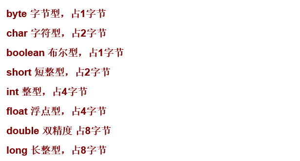

- 强制类型转换：小转大无问题，大转小会有精度丢失问题。
- 引用数据类型声明后类型便不可更改，其默认值为null。
- 基本数据类型默认值列表:
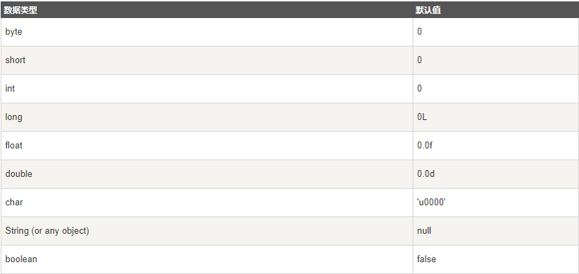

- 方法的重载是指一个类中可以定义有相同的名字，但参数有不同的个数、或参数为不同类型的多个方法，调用时会根据不同的参数列表而选择对应的方法
- **方法的重载和方法返回值类型没有关系**
- 构造器也可以重载
- 重载与重写区别：
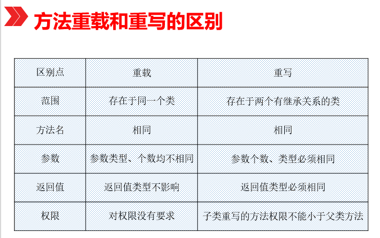

### java 关键字
访问修饰符关键字及包关键字：
 - **private**：被该关键字修饰只能在当前类下访问模式
 - **protected**：被该关键字修饰在同一个包下都可以访问
 - **public**：公共修饰，被该关键字修饰所有类都可以访问
 - **import**: 导入所需要的包
 - **package**: 该类所属于包
  
修饰方法、类、属性和变量和包关键字：
 - **static**: 静态属性和方法都可以用static修饰，直接使用类名.属性和方法名。 只有内部类可以使用static关键字修饰，调用直接使用类名.内部类类名进行调用。static可以独立存在静态块。
 - **final**: 方法和类都可以用final来修饰。final修饰的类是不能被继承的。final修饰的方法是不能被子类重写。final修饰的属性就是常量。
 - super 调用父类方法，也在在构造方法中调用super（）去初始化父类，但是构造方法中super不能与this连用。
 - **this**:相当于该类的实例对象，可以可以调用该类所有方法字段。也可以在构造函数中使用this调用其他构造函数，只能放第一排，不能与super连用。
 - **throw**: 抛出异常，写在方法体内，将异常抛出。
 - **throws**: 声明一个异常可能被抛出，作用在方法上，自己不处理，交给调用者处理。
 - **enum**: 声明枚举类型。
 - **assert**: 断言。

 - **synchronized**: 同步:使用了该关键字表示使用在静态方法上或静态方法内时，锁对象为该类的class对象。如果在没有static修饰的方法上或方法内锁对象为该类实例对象。
- **transient**: 被该关键字修饰的字段，在进行序列化时该字段不会被序列化 。
- **volatile**: 保证被修饰字段的可见性和不会被指令重排。


## Collection
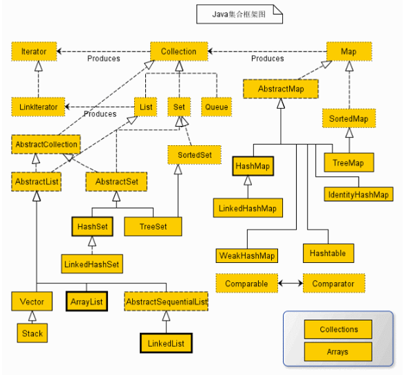
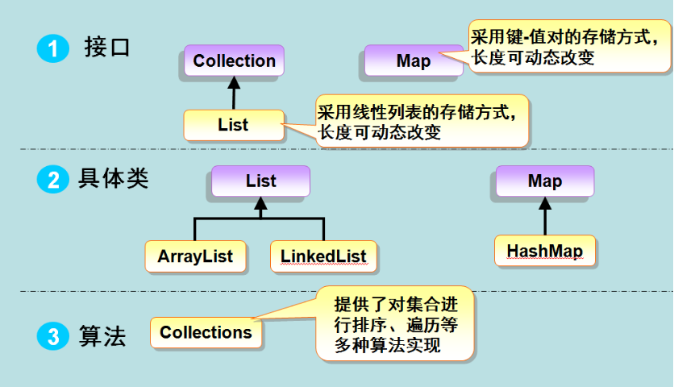

- **List接口**：List接口是一个有序的 Collection，使用此接口能够精确的控制每个元素插入的位置，能够通过索引(元素在List中位置，类似于数组的下标)来访问List中的元素，第一个元素的索引为 0，而且允许有相同的元素。List 接口存储一组不唯一，有序（插入顺序）的对象。

- **Set**：Set 具有与 Collection 完全一样的接口，只是行为上不同，Set 不保存重复的元素。Set 接口存储一组唯一，无序的对象。
- **SortedSet**： 继承于Set保存有序的集合。


**list/set** dif：
1. Set 接口实例存储的是无序的，不重复的数据。List 接口实例存储的是有序的，可以重复的元素。
2. Set检索效率低下，删除和插入效率高，插入和删除不会引起元素位置改变 <实现类有HashSet,TreeSet>。
3. List和数组类似，可以动态增长，根据实际存储的数据的长度自动增长List的长度。查找元素效率高，插入删除效率低，因为会引起其他元素位置改变。 实现类有:ArrayList,LinkedList,Vector。

> HashSet: 允许包含值为null的元素，但最多只能一个。 ArrayList:允许有多个null元素。

>**LinkedList**:
该类实现了List接口，允许有null（空）元素。主要用于创建链表数据结构，该类**没有同步方法**，如果多个线程同时访问一个List，则必须自己实现访问同步，解决方法就是在创建List时候构造一个同步的List。例如：
````
    Listlist=Collections.synchronizedList(newLinkedList(...));
````
> 	**ArrayList**:
该类也是实现了List的接口，实现了可变大小的数组，随机访问和遍历元素时，提供更好的性能。该类也是**非同步**的,在多线程的情况下不要使用。ArrayList 增长当前长度的50%，插入删除效率低。

other:
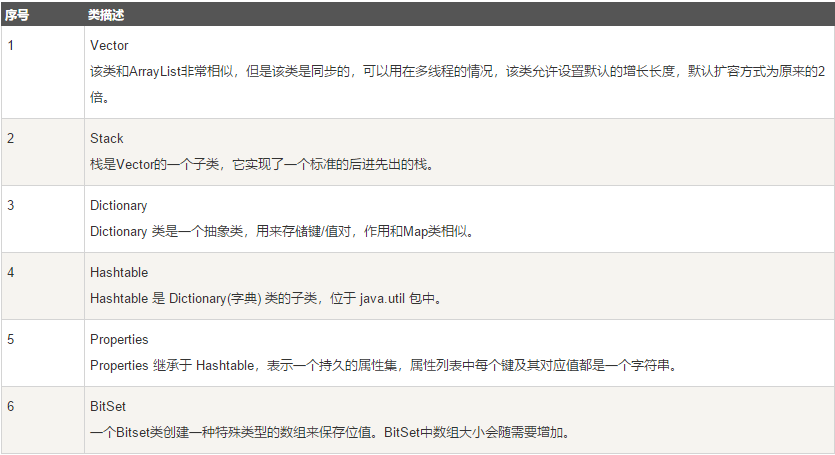

迭代器:
> 一般遍历数组都是采用for循环或者增强for，这两个方法也可以用在集合框架，但是还有一种方法是采用迭代器遍历集合框架，它是一个对象，实现了**Iterator** 接口或**ListIterator**接口。
迭代器，使你能够通过循环来得到或删除集合的元素。**ListIterator** 继承了**Iterator**，以允许双向遍历列表和修改元素。

实例:
- 遍历集合:
````
import java.util.*;
 
public class Test{
 public static void main(String[] args) {
     List<String> list=new ArrayList<String>();
     list.add("Hello");
     list.add("World");
     list.add("HAHAHAHA");
     //第一种遍历方法使用foreach遍历List
     for (String str : list) {            //也可以改写for(int i=0;i<list.size();i++)这种形式
        System.out.println(str);
     }
 
     //第二种遍历，把链表变为数组相关的内容进行遍历
     String[] strArray=new String[list.size()];
     list.toArray(strArray);
     for(int i=0;i<strArray.length;i++) //这里也可以改写为  foreach(String str:strArray)这种形式
     {
        System.out.println(strArray[i]);
     }
     
    //第三种遍历 使用迭代器进行相关遍历
     
     Iterator<String> ite=list.iterator();
     while(ite.hasNext())//判断下一个元素之后有值
     {
         System.out.println(ite.next());
     }
 }
}

````
- 遍历map：
````
import java.util.*;
 
public class Test{
     public static void main(String[] args) {
      Map<String, String> map = new HashMap<String, String>();
      map.put("1", "value1");
      map.put("2", "value2");
      map.put("3", "value3");
      
      //第一种：普遍使用，二次取值
      System.out.println("通过Map.keySet遍历key和value：");
      for (String key : map.keySet()) {
       System.out.println("key= "+ key + " and value= " + map.get(key));
      }
      
      //第二种
      System.out.println("通过Map.entrySet使用iterator遍历key和value：");
      Iterator<Map.Entry<String, String>> it = map.entrySet().iterator();
      while (it.hasNext()) {
       Map.Entry<String, String> entry = it.next();
       System.out.println("key= " + entry.getKey() + " and value= " + entry.getValue());
      }
      
      //第三种：推荐，尤其是容量大时
      System.out.println("通过Map.entrySet遍历key和value");
      for (Map.Entry<String, String> entry : map.entrySet()) {
       System.out.println("key= " + entry.getKey() + " and value= " + entry.getValue());
      }
    
      //第四种
      System.out.println("通过Map.values()遍历所有的value，但不能遍历key");
      for (String v : map.values()) {
       System.out.println("value= " + v);
      }
     }
}
````
> 集合框架的类和接口均在**java.util**包中。
任何对象加入集合类后，自动转变为**Object**类型，所以在取出的时候，需要进行**强制类型转换**。

## JSON解析
常用框架:
1. Jackson (springboot默认使用)
2. 阿里FastJson
3. 谷歌Gson

- Jackson使用:
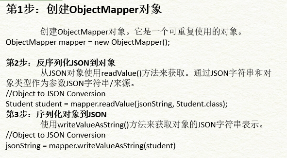
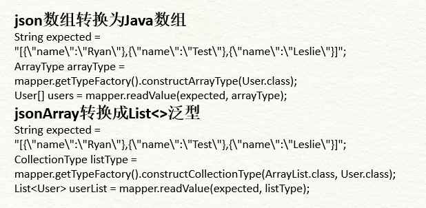

## httpClient
- 网络协议 三层、四层
- 状态码等协议具体信息  
- java 常用http请求框架

Java实现http请求方法:
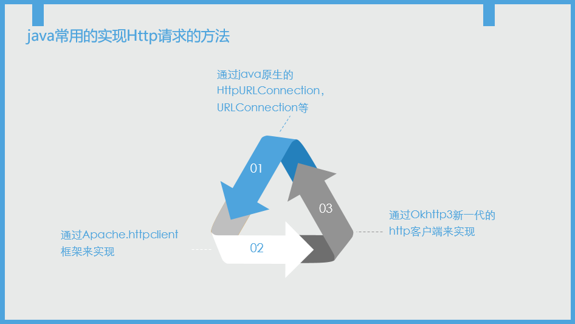

**httpClient特性**:
1. 实现了所有 HTTP 的方法（GET,POST,PUT,HEAD 等）
2. 支持自动转向
3. 支持 HTTPS 协议
4. 支持代理服务器等

创建流程:
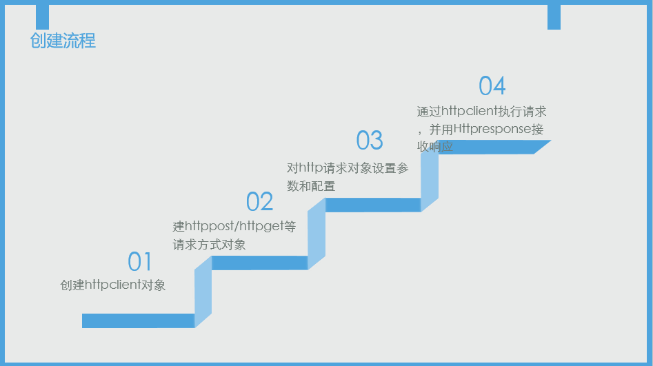
实例：
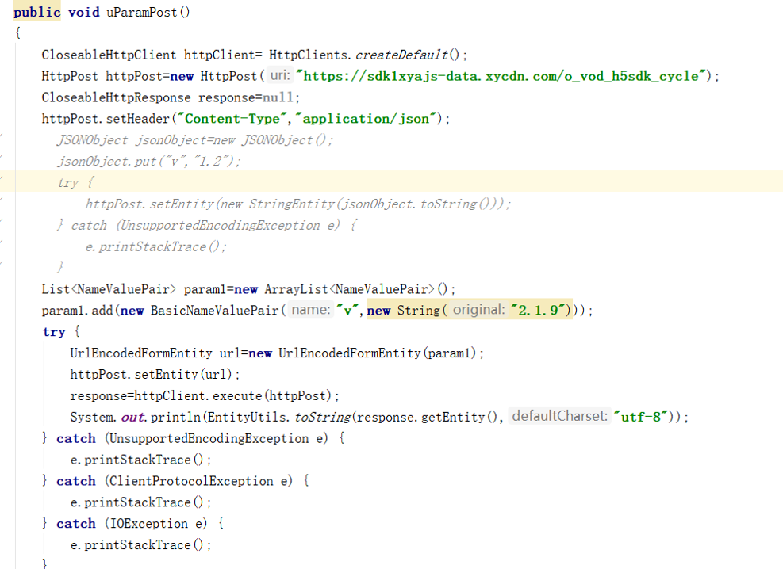

## Socket


## IO/NIO 


## 线程相关


# 数据库相关

数据库null：

基础：

- select
- 
    > distinct > 去除重复
    ````
    SELECT DISTINCT column1, column2....columnN
    FROM   table_name;
    ````

    > count
    ````
    SELECT COUNT(column_name)
    FROM   table_name
    WHERE  CONDITION;
    ````

    > 字符串连接: || > 用sql实现循环所做的逻辑 --oracle用mysql没有该方法,
    mysql 使用concat()/concat_ws()进行操作。

- 查询条件与排序
-
    > where 
    -
        > between
        ````
        SELECT column1, column2....columnN
        FROM   table_name
        WHERE  column_name BETWEEN val-1 AND val-2;
        ````

        > like （% | - ）
        ````
        SELECT column1, column2....columnN
        FROM   table_name
        WHERE  column_name LIKE { PATTERN };
        ````

        > in | not in (效率低)
        ````
        SELECT column1, column2....columnN
        FROM   table_name
        WHERE  column_name IN (val-1, val-2,...val-N);
        ````
        > and | or
        ````
        SELECT column1, column2....columnN
        FROM   table_name
        WHERE  CONDITION-1 {AND|OR} CONDITION-2;
        ````

        > order by (asc | desc)
        ````
        SELECT column1, column2....columnN
        FROM   table_name
        WHERE  CONDITION
        ORDER BY column_name {ASC|DESC};
        ````
        > order by (asc | desc)
        ````
        SELECT column1, column2....columnN
        FROM   table_name
        WHERE  CONDITION
        ORDER BY column_name {ASC|DESC};
        ````
        > group by
        ````
        SELECT SUM(column_name)
        FROM   table_name
        WHERE  CONDITION
        GROUP BY column_name;
        ````
        >having
        ````
        SELECT SUM(column_name)
        FROM   table_name
        WHERE  CONDITION
        GROUP BY column_name
        HAVING (arithematic function condition);
        ````
- 运算符
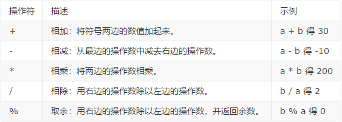
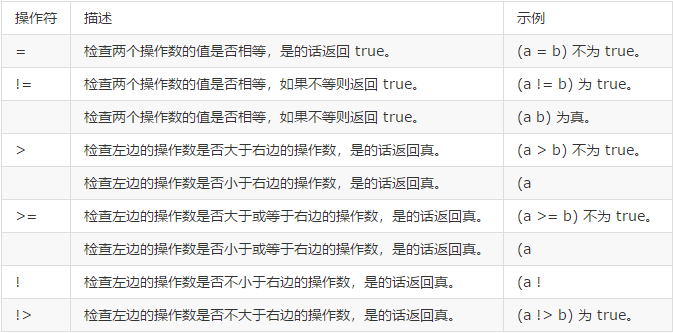
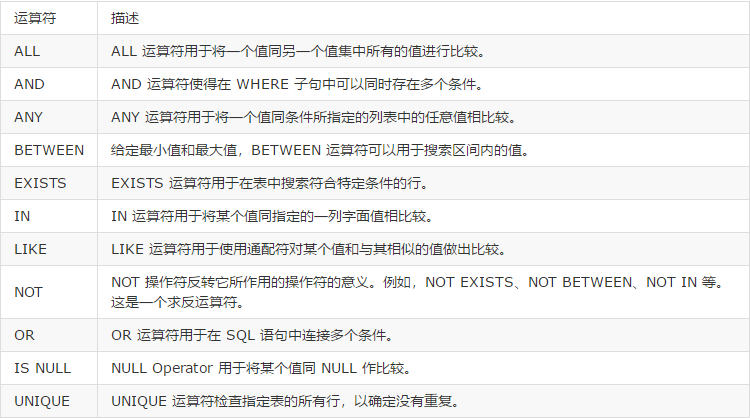

- DML语句 - 操作语句
- 
  > insert
    ````
    INSERT INTO TABLE_NAME (column1, column2, column3,...columnN) 
    VALUES (value1, value2, value3,...valueN);
    INSERT INTO TABLE_NAME VALUES (value1,value2,value3,...valueN);
    ````
  > update

  - 当存在约束时某些更新会更新失败。

  > delete
  - 当存在约束时某些会删除失败。

表结构相关：
- CREATE TABLE
````
 CREATE TABLE table_name(
    column1 datatype,
    column2 datatype,
    column3 datatype,
    .....
    columnN datatype,
    PRIMARY KEY( one or more columns )
    );
````
- DROP TABLE
````
 DROP TABLE table_name;
````
- CREATE INDEX
````
CREATE UNIQUE INDEX index_name ON table_name ( column1, column2,...columnN);
````
- DROP INDEX
````
ALTER TABLE table_name DROP INDEX index_name;
````
- TRUNCATE TABLE
````
TRUNCATE TABLE table_name;
````
- DELETE
````
DELETE FROM table_name WHERE  {CONDITION};
````
- ALTER TABLE

- COMMIT
````
COMMIT;
````

- ROLLBACK
````
ROLLBACK;
````

进阶：
- 多表查询：
- 自连接
- 交叉连接